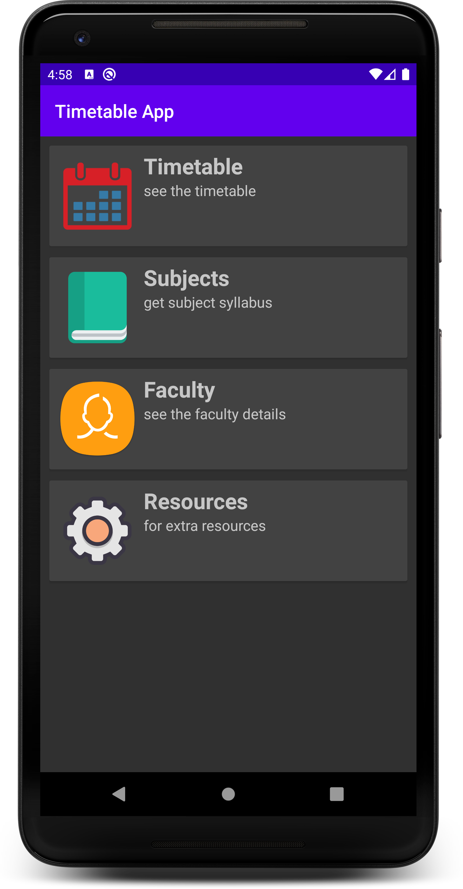
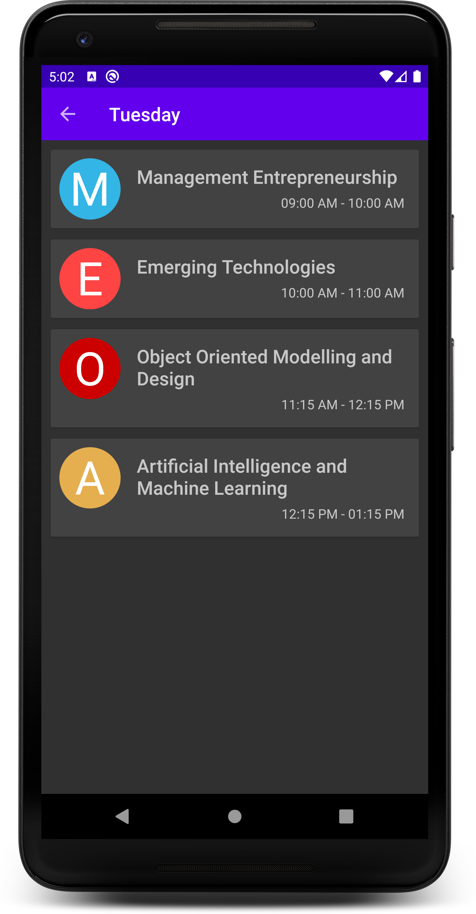
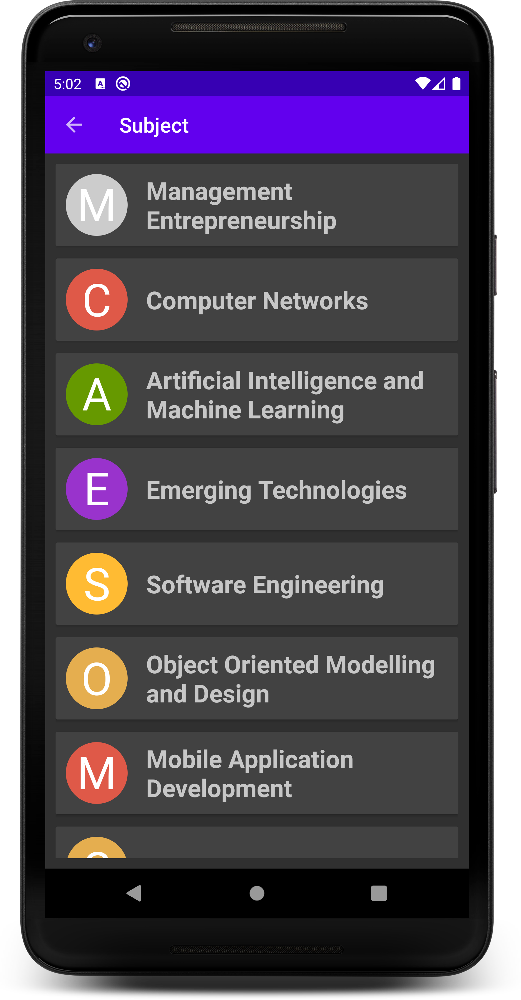
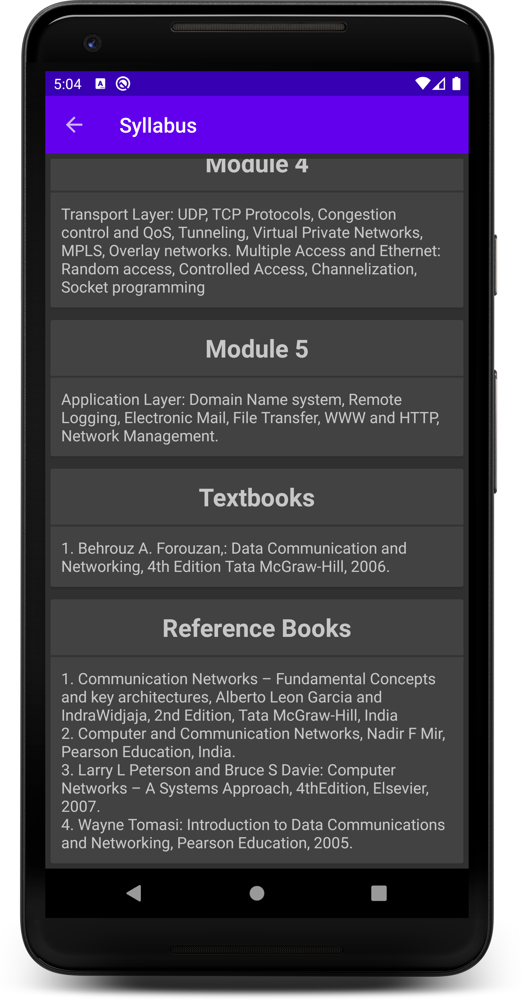
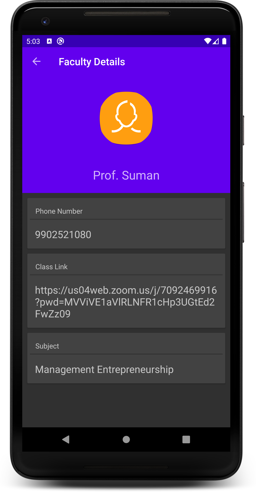

# TimeTable-App
Description: Android application that shows timetable with class timings, faculty details with their contact info like email and phone numbers and subject details with the complete syllabus.
# Screenshots

  
  
  
  
  

